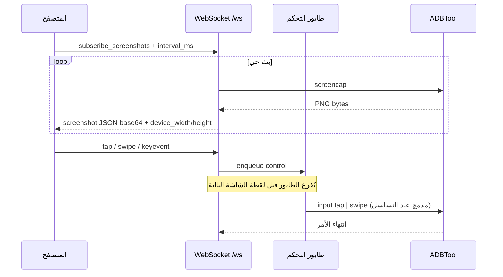
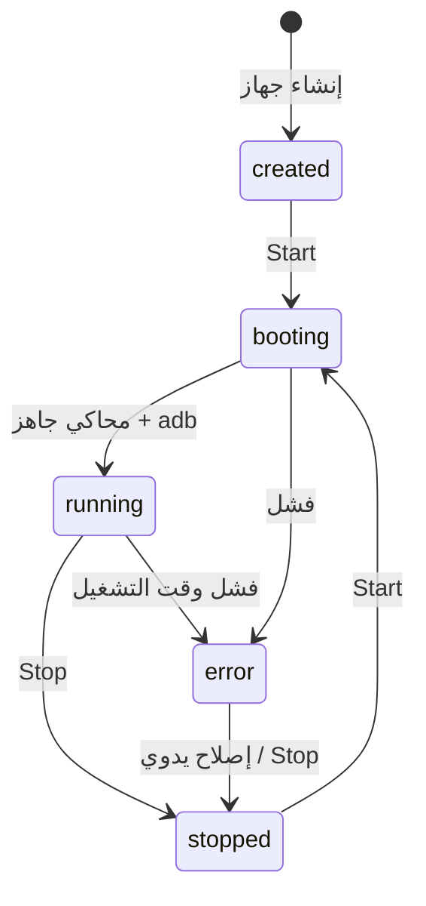

# Android Emulator Farm — مزرعة محاكيات أندرويد

[](https://github.com/YOUR_GITHUB_USER/YOUR_REPO/actions/workflows/ci.yml)


**English:** Web-based **Android Virtual Device (AVD) farm**: create devices, unique fingerprints per instance, start/stop emulators, live screen over WebSocket (JPEG), touch/drag via ADB, APK store, proxy config, SAMFW firmware alignment, REST + OpenAPI.

**العربية:** منصة متكاملة لإدارة **محاكيات Android (AVD)** من المتصفح وواجهة REST: إنشاء أجهزة، **بصمة جهاز مستقلة** لكل محاكي، تشغيل/إيقاف، **بث شاشة حي** عبر WebSocket، تحكم لمسي عبر ADB، **مستودع APK**، إعداد بروكسي، مواءمة حزم **SAMFW**، ووثائق OpenAPI.

> **اقتراح لوصف مستودع GitHub (About):**  
> *Android AVD farm — FastAPI + React: live WebSocket mirror, ADB input, per-device fingerprint spoofing, APK store, proxy, Docker, SAMFW presets.*

---

## جدول المحتويات

1. [نظرة عامة وآلية العمل](#نظرة-عامة-وآلية-العمل)
2. [رسم توضيحي — البنية المعمارية](#رسم-توضيحي--البنية-المعمارية)
3. [رسم توضيحي — تدفق البث والتحكم](#رسم-توضيحي--تدفق-البث-والتحكم)
4. [رسم توضيحي — دورة حياة الجهاز](#رسم-توضيحي--دورة-حياة-الجهاز)
5. [المميزات (الإصدار الحالي)](#المميزات-الإصدار-الحالي)
6. [المكدس التقني](#المكدس-التقني)
7. [التشغيل السريع](#التشغيل-السريع)
8. [واجهات API و WebSocket](#واجهات-api-و-websocket)
9. [حزم SAMFW والبصمة](#حزم-samfw-والبصمة)
10. [النسخة المطوّرة V2 Pro — 1,000 USD](#النسخة-المطوّرة-v2-pro--1000-usd)
11. [GitHub Topics (وسوم مقترحة)](#github-topics-وسوم-مقترحة)
12. [الصيانة والشركة والاتصال](#الصيانة-والشركة-والاتصال)
13. [دعم المشروع (اختياري)](#دعم-المشروع-اختياري)
14. [الترخيص](#الترخيص)

---

## نظرة عامة وآلية العمل

المشروع يفصل بين **طبقة التحكم** (FastAPI + قاعدة بيانات + مجدول) و**واجهة المستخدم** (React + Vite) و**عميل ADB** على الخادم الذي يتحدث مع المحاكيات أو الأجهزة المتصلة.

- المستخدم يسجّل الدخول ويحصل على **JWT**.
- تُنشأ **أجهزة (Device)** في قاعدة البيانات مرتبطة بمستخدم؛ لكل جهاز سجل **بصمة (Fingerprint)** واختياريًا **بروكسي**.
- عند **Start** يشغّل الخادم عملية **emulator** (AVD) أو يربط **ADB serial** حسب الإعداد؛ يُخزَّن المنفذ/المعرّف للتحكم لاحقًا.
- **لقطات الشاشة الحية**: عميل WebSocket يشترك في `subscribe_screenshots`؛ الخادم ينفّذ `adb screencap` (مع قفل لكل جهاز لتفادي التعارض)، يُحوّل الإطار إلى JPEG خفيف عند الطلب، ويرسله كـ Base64 مع أبعاد الجهاز لتعيين إحداثيات اللمس بشكل صحيح.
- **اللمس والسحب**: الواجهة ترسل `tap` / `swipe` عبر WebSocket؛ الخادم يضع الرسائل في طابور **يُصفّى قبل** أخذ لقطة جديدة حتى لا تُحجب أوامر التحكم عن طريق screencap الطويل. على الخادم يمكن **دمج مقاطع السحب المتسلسلة** في أمر `swipe` واحد لتقليل استدعاءات ADB مع الحفاظ على نفس المسار الكلي.
- **مستودع APK**: رفع حزم إلى التخزين وتثبيتها على جهاز شغّال عبر ADB (بما في ذلك دعم **split APKs** حيث يُطبّق المشروع منطق `install-multiple` عند الحاجة).

مرجع مواصفات موسّع ومقارنة متطلبات: [`docs/REFERENCE_SPEC.md`](docs/REFERENCE_SPEC.md).

---

## رسم توضيحي — البنية المعمارية


---

## رسم توضيحي — تدفق البث والتحكم



---

## رسم توضيحي — دورة حياة الجهاز



---

## المميزات (الإصدار الحالي)

| المجال | الوصف |
|--------|--------|
| **إدارة الأجهزة** | إنشاء/قائمة/تشغيل/إيقاف، موارد (RAM/CPU/API)، ارتباط بـ AVD وADB serial |
| **بصمة لكل جهاز** | IMEI، Android ID، build fingerprint، طراز، شبكة، موقع، حقول Samsung AP/CSC، تطبيق عبر `setprop` حيث يسمح النظام |
| **واجهة ويب** | لوحة، أجهزة، تفاصيل جهاز (شاشة، بصمة، تطبيقات، بروكسي، سجلات)، **App Store** للـ APK |
| **بث شاشة** | WebSocket، JPEG قابل للضبط، تقليل التكرار عند خمول الإطار (حسب إعدادات المشروع) |
| **إدخال** | لمس، سحب متعدد المقاطع، أزرار نظام، إدخال نص عبر ADB |
| **شبكة** | إعداد HTTP/SOCKS5 للجهاز (حسب تنفيذ المشروع) |
| **حزم SAMFW** | اكتشاف الحزم تحت `firmware/` واقتراح presets ومواءمة حقول البصمة |
| **أمان أساسي** | JWT، أدوار مستخدم/أدمن، امتلاك الأجهزة |
| **Docker** | `docker-compose` للتشغيل المتكامل مع Postgres/Redis/Nginx |
| **CI** | GitHub Actions: باكند، فرونت، التحقق من compose |

---

## المكدس التقني

| الطبقة | التقنيات |
|--------|----------|
| Backend | Python 3.11+، FastAPI، SQLAlchemy (async)، Pydantic، Uvicorn |
| DB | PostgreSQL (إنتاج) / SQLite + aiosqlite (تطوير محلي عبر `run_dev_local.sh`) |
| Frontend | React 18، TypeScript، Vite، Tailwind، React Router، TanStack Query، Zustand |
| DevOps | Docker Compose، Nginx، GitHub Actions |
| Android | Android SDK / `emulator`، `adb`، AVD |

---

## التشغيل السريع

### Docker (موصى به للتجربة الكاملة)

```bash
docker compose -f docker/docker-compose.yml up --build
```

الواجهة غالبًا على **http://localhost:8080** والـ API تحت **`/api/...`** (راجع إعدادات Nginx في `docker/`).

### تطوير محلي (SQLite) — سكربت جاهز

```bash
./scripts/run_dev_local.sh
```

### تطوير يدوي (مختصر)

```bash
cd backend && python3.12 -m venv .venv && source .venv/bin/activate && pip install -r requirements.txt && uvicorn main:app --reload --port 8000
cd frontend && npm install && npm run dev
```

تفاصيل SDK والمحاكي: أنظر الأقسام السابقة في المستودع و [`firmware/README.md`](firmware/README.md).

### حزمة توزيع

```bash
./scripts/package_release.sh
```

---

## واجهات API و WebSocket

- **REST:** `Authorization: Bearer <token>` بعد `/api/auth/login` — وثائق تفاعلية: `/docs` (Swagger).
- **WebSocket:** `ws://<host>/ws/{device_id}?token=<jwt>` — اشتراك لقطات، `tap` / `swipe` / `keyevent` / `input_text`.

جدول مختصر لنقاط أساسية موجود أيضًا في الأرشيف السابق للمشروع؛ للتفصيل الكامل راجع [`docs/REFERENCE_SPEC.md`](docs/REFERENCE_SPEC.md).

---

## حزم SAMFW والبصمة

ضع أرشيفات ZIP (مثل حزم SAMFW) تحت [`firmware/`](firmware/) واتبع [`firmware/README.md`](firmware/README.md).  
**لا تُرفع** ملفات ZIP الضخمة إلى Git افتراضيًا (مستبعدة في `.gitignore`).

---

## النسخة المطوّرة V2 Pro — 1,000 USD

**الإصدار الثاني (V2 Pro)** موجّه للفرق والشركات التي تحتاج **أداءً أعلى، تشغيلًا أوسع، ودعمًا تجاريًا**. السعر المرجعي للحزمة المطوّرة: **1,000 USD** (للمناقشة والترخيص والنطاق — اتصل بالمسؤول أدناه).

### مميزات V2 (مقترحة قوية)

| الميزة | الفائدة |
|--------|---------|
| **مسار فيديو منخفض الزمن** | تكامل **gRPC / WebRTC** (أسلوب scrcpy/EmulatorController) للمحاكي المحلي — بث أقرب للّحظي مقارنة بـ ADB screencap فقط |
| **إدخال لمسي متقدم** | تيار لمس أقرب للطبيعي (ضغط، متعدد اللمس حيث ينطبق) بدل اعتماد `input swipe` فقط |
| **تعدد المستأجرين (Multi-tenant)** | عزل بيانات، حصص، وفوترة حسب الاستخدام |
| **RBAC وصلاحيات دقيقة** | أدوار مخصصة، سياسات وصول للأجهزة والمستودعات |
| **تسجيل وإعادة تشغيل الجلسات** | Session replay للاختبار، التدقيق، والتدريب |
| **مزرعة متعددة العقد** | جدولة عبر أكثر من خادم، طوابير ذكية، مراقبة صحة العقد |
| **مراقبة ومقاييس** | لوحة Grafana/Prometheus — FPS، زمن الإطار، زمن ADB، استخدام CPU/RAM لكل جهاز |
| **Webhooks + أتمتة** | أحداث الجهاز (تشغيل/إيقاف/خطأ) إلى CI/CD أو Slack/Discord |
| **حزم بصمات احترافية** | تحديثات دورية لقوالب بصمات متوافقة مع أسواق/شرائح محددة |
| **تشفير وأسرار** | تكامل Secret manager، تشفير حقول حساسة في القاعدة، سياسات تدوير مفاتيح |
| **White-label** | شعار، ألوان، ونطاق مخصص للواجهة |
| **دعم مميز وSLA** | قناة دعم أولوية، اتفاقيات وقت استجابة للإنتاج |

> V2 ليس فرعًا مفتوح المصدر تلقائيًا في هذا المستودع؛ التفاصيل التجارية عبر قنوات الاتصال في الأسفل.

---

## GitHub Topics (وسوم مقترحة)

انسخها إلى حقل **Topics** في إعدادات المستودع:

```
android
android-emulator
avd
adb
fastapi
react
typescript
websocket
docker
docker-compose
postgresql
sqlite
fingerprint
device-farm
remote-control
apk
samfw
devops
openapi
jwt
```

---

## ماذا يفعل الـ CI؟

سير العمل [`.github/workflows/ci.yml`](.github/workflows/ci.yml):

1. Backend: `requirements.txt`، `compileall`، تحميل تطبيق FastAPI.
2. Frontend: `npm ci` / `npm install` + `npm run build`.
3. التحقق من صحة ملفات Docker Compose.

---

## الصيانة والشركة والاتصال

| | |
|--|--|
| **Developer** | Mostafa El-Bagory |
| **Company** | Storage TE |
| **WhatsApp** | +20 100 199 5914 |

---

## دعم المشروع (اختياري)

إذا كان هذا التوثيق (أو الأدوات الخاصة المرتبطة به) مفيدًا لك، فالدعم **الاختياري** يساعد على الصيانة والتطوير. اختر الطريقة الأنسب لك.

| Channel | How to support |
|---------|----------------|
| **PayPal** | [paypal.me/sofaapi](https://paypal.me/sofaapi) |
| **Binance Pay / UID** | **1138751298** — أرسل من تطبيق Binance (Pay / تحويل داخلي عند توفره). |
| **Binance — إيداع (ويب)** | سجّل الدخول، اختر الأصل، ثم شبكة **BSC (BEP20)** للإيداع. |
| **عنوان BSC (للنسخ)** | `0x94c5005229784d9b7df4e7a7a0c3b25a08fd57bc` |
| **الشبكة** | استخدم **BSC (BEP-20) فقط**. العنوان مناسب لـ **USDT (BEP-20)** و**BTC على BSC** (Binance-Peg / «BTC» على BSC داخل التطبيق كما تظهر شاشات الإيداع). **لا ترسل** Bitcoin أصلي على سلسلة BTC، ولا ERC-20، ولا NFTs إلى هذا العنوان. |

### رموز QR للإيداع (مسح من Binance أو أي محفظة BSC)

ضع ملفات الصور تحت [`assets/`](assets/) كما في [`assets/README.md`](assets/README.md):

| الأصل | الملف المقترح |
|--------|----------------|
| USDT · BSC | `assets/usdt-bsc-qr.png` |
| BTC · BSC | `assets/btc-bsc-qr.png` |

---

## الترخيص

الكود المرخّص صراحةً تحت [MIT License](LICENSE) ما لم يُذكر خلاف ذلك لملفات أو حزم طرف ثالث.

---

## رفع المستودع إلى GitHub (عام)

إذا لم يكن لديك Git بعد في المجلد:

```bash
cd /path/to/emulator-android
git init
git add .
git commit -m "chore: initial public release — docs, MIT license, assets"
```

على GitHub: **New repository** → **Public** → بدون README إن كان محليًا جاهزًا.

```bash
git remote add origin https://github.com/YOUR_USER/YOUR_REPO.git
git branch -M main
git push -u origin main
```

ثم استبدل `YOUR_GITHUB_USER` و `YOUR_REPO` في شارة الـ CI أعلى هذا الملف.
