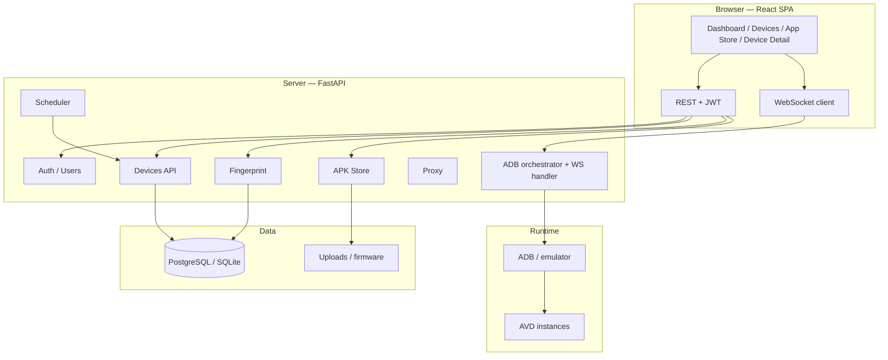
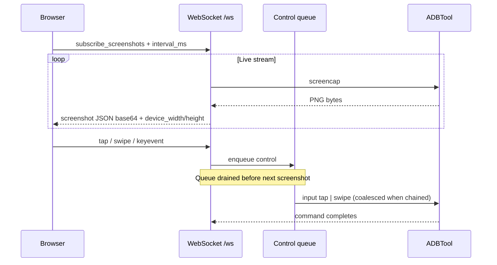
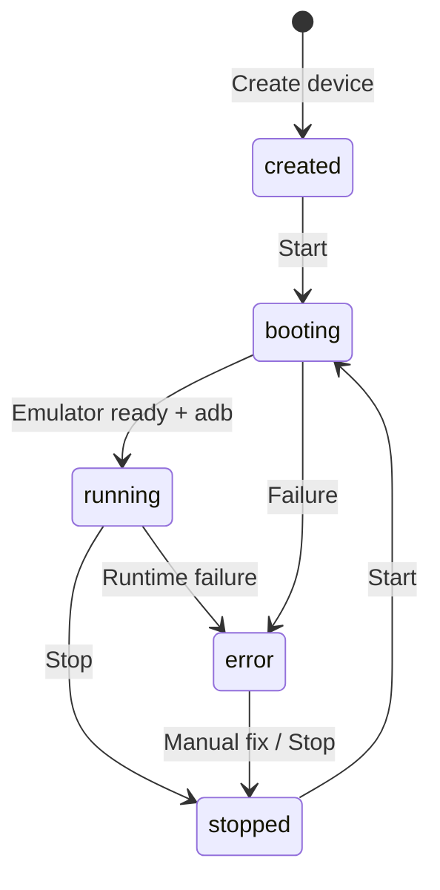
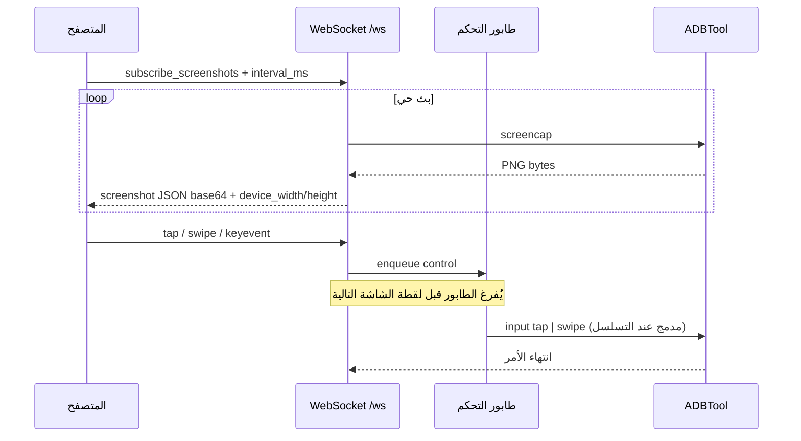
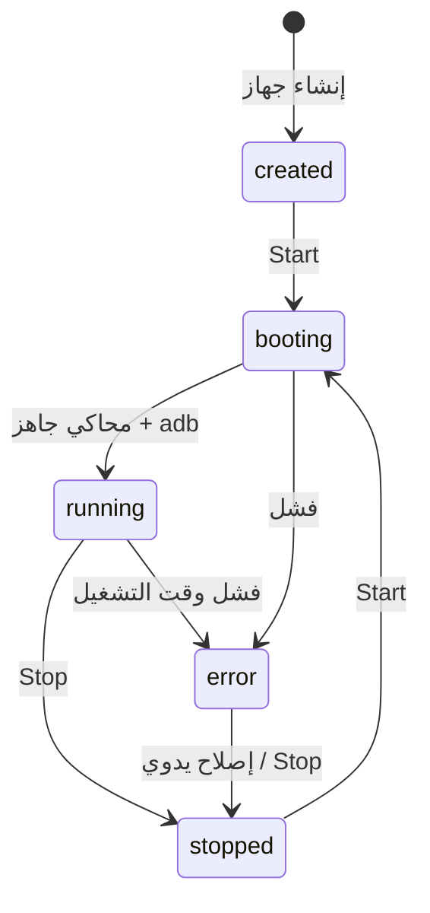

# Android Emulator Farm

> **Language / اللغة:** The **default** README is **English** (Part I). **Full Arabic** documentation is in **Part II** — [انتقل إلى العربية](#part-ii--arabic-documentation-العربية) · [Jump to Arabic](#part-ii--arabic-documentation-العربية).

[](https://github.com/code-root/emulator-android/actions/workflows/ci.yml)


Web-based **Android Virtual Device (AVD) farm**: create emulated devices, **unique fingerprints** per instance, start/stop, **live screen** over WebSocket (**JPEG and optional H.264**), **touch/drag** via ADB, **APK store**, HTTP/SOCKS proxy, **SAMFW / Odin folder** firmware alignment, **fingerprint hub API** with revisions, **AVD hardware profile sync** for Samsung vs Pixel, REST API + OpenAPI/Swagger.

**Suggested GitHub “About” description:**  
*Android AVD farm — FastAPI + React: live WebSocket mirror, ADB input, per-device fingerprint spoofing, APK store, proxy, Docker, SAMFW presets.*

---

## Part I — English (default)

### Table of contents

1. [Overview & how it works](#overview--how-it-works)
2. [Architecture diagram](#architecture-diagram)
3. [Live stream & control flow](#live-stream--control-flow)
4. [Device lifecycle](#device-lifecycle)
5. [Features (current release)](#features-current-release)
5a. [Recent updates (March 2026)](#recent-updates-march-2026)
6. [Tech stack](#tech-stack)
7. [Quick start](#quick-start)
8. [REST API & WebSocket](#rest-api--websocket)
9. [SAMFW packages & fingerprint](#samfw-packages--fingerprint)
10. [V2 Pro — USD 1,000](#v2-pro--usd-1000)
11. [Suggested GitHub Topics](#suggested-github-topics)
12. [CI](#ci)
13. [Maintainer, company & contact](#maintainer-company--contact)
14. [Support this project (optional)](#support-this-project-optional)
15. [Python package, tarball & releases](#python-package-tarball--releases)
16. [License](#license)
17. [Publishing to GitHub](#publishing-to-github)

---

### Overview & how it works

The stack splits **control plane** (FastAPI + DB + scheduler), **web UI** (React + Vite), and an **ADB client** on the server talking to emulators or attached devices.

- Users authenticate and receive a **JWT**.
- **Devices** are stored in the DB per owner; each device has a **fingerprint** profile and optional **proxy**.
- **Start** launches an **emulator (AVD)** or binds an **ADB serial**; ports/IDs are persisted for control.
- **Live screenshots:** the browser subscribes via WebSocket (`subscribe_screenshots`); the server runs `adb screencap` (per-device locking to avoid races), optionally encodes **JPEG**, sends Base64 JSON with **device_width / device_height** for correct touch mapping.
- **Touch & drag:** the UI sends `tap` / `swipe` over WebSocket; messages go through a **control queue drained before** the next screencap so long captures do not starve input. **Chained swipe segments** can be **coalesced** server-side into one logical `swipe` (fewer ADB round-trips, same end-to-end path).
- **APK store:** upload packages and install on running devices via ADB, including **split APK** flows (`install-multiple`) where applicable.

Extended spec: [`docs/REFERENCE_SPEC.md`](docs/REFERENCE_SPEC.md).

---

### Architecture diagram



---

### Live stream & control flow



---

### Device lifecycle



---

### Features (current release)

| Area | Description |
|------|-------------|
| **Device management** | CRUD-style lifecycle, RAM/CPU/API level, AVD name + ADB serial |
| **Per-device fingerprint** | IMEI, Android ID, build fingerprint, model/network/geo, Samsung AP/CSC, `setprop` where allowed |
| **Web UI** | Dashboard, devices, device detail (screen, fingerprint, apps, proxy, logs), **App Store** |
| **Screen mirror** | WebSocket, configurable JPEG, idle-frame deduplication (project settings) |
| **Input** | Tap, multi-segment drag, system keys, `input text` via ADB |
| **Network** | HTTP / SOCKS5 proxy configuration (per implementation) |
| **SAMFW** | Discover packages under `firmware/`, suggested presets, fingerprint alignment |
| **Security** | JWT, user/admin roles, device ownership |
| **Docker** | Compose stack with Postgres / Redis / Nginx |
| **CI** | GitHub Actions: backend, frontend, compose validation |
| **H.264 stream** | Optional low-latency screen path over WebSocket (where enabled) |
| **Fingerprint hub** | `/api/fingerprint/*` — revisions, revert, compare, validate, extended JSON |
| **Anti-emulator props** | Layered `setprop` + console + Frida script template; auto-apply after boot |

---

### Recent updates (March 2026)

This release focuses on **Samsung-aligned fingerprints**, **clearer AVD hardware identity**, **firmware package discovery**, and **operator-facing APIs/UI**.

#### Fingerprint system

- **`/api/fingerprint/{device_id}`** (hub): unified REST for full fingerprint documents, optional **`extended`** JSON (extra SIM, sensors, battery, PLMN, etc.), **`revision_label`** on writes.
- **Revisions**: table `fingerprint_revisions` — list, **revert** to a snapshot, **compare** current vs a revision.
- **Apply & randomize** on the hub run **consistency checks** before apply (422 on hard failures).
- **`GET /api/fingerprint/profiles/list`** — device profile silhouettes for editors.
- **Merge path**: `fingerprint_row_to_apply_dict()` merges SQL columns + `extended_json` for the spoofer (legacy `/api/devices/.../fingerprint` uses the same merge).
- **Samsung extended props**: large `ro.product` / `ro.vendor` / CSC map via [`backend/core/fingerprint/samsung_enhanced.py`](backend/core/fingerprint/samsung_enhanced.py); many keys **fail on AVD** (expected — image is AOSP, not One UI). Apply response includes **`note`** and **`detail`** explaining this.
- **Auto-apply on boot**: after a device **starts** successfully, the server runs **fingerprint + anti-detect apply** once (same as manual “Apply”), logged as `fingerprint_auto_apply`.

#### SAMFW / Odin firmware folder names

- **Odin-style directory** names such as `G996BXXSJHZA6_G996BOXMJHZA6_XSG` under [`firmware/`](firmware/) are parsed in [`backend/core/firmware/samfw.py`](backend/core/firmware/samfw.py) (AP, CSC, sales code, locale hints).
- **`merge_firmware_into_fingerprint`** updates `ap_version`, `csc_version`, build fingerprint PDA segment; **XSG** maps fingerprint **product** segment to **`o1sxxx`** (non-EEA style).
- **Tests**: [`backend/tests/test_firmware_xsg.py`](backend/tests/test_firmware_xsg.py).
- **Create device**: optional **`firmware_package`** (ZIP or folder basename) in API; **web UI** loads options from **`GET /api/meta/firmware-packages`**.
- **Real Samsung ROM (One UI)**: set **`emulator_kind`**: **`physical`** and **`host_adb_serial`** (first column of `adb devices`) in **`POST /api/devices`** — no AVD is created; the connected phone runs your actual Samsung system.

#### AVD hardware (Android Studio “Properties”)

- Samsung fingerprints: AVD is created with **`medium_phone`** (SDK has no Samsung device id) then **`~/.android/avd/<name>.avd/config.ini`** is patched: **`hw.device.manufacturer=Samsung`**, **`hw.device.name=medium_phone`**, LCD **1080×2400** / **420** dpi for common **SM-G996B** class devices.
- **Every device start** and **every fingerprint save path** (PUT, randomize, revert on hub + legacy PUT/randomize) calls **`sync_avd_hardware_with_fingerprint`** so the INI stays aligned after edits.

#### Anti-detection

- [`backend/core/fingerprint/anti_detect.py`](backend/core/fingerprint/anti_detect.py): **`ro.build.characteristics`** favours **`default`** for Samsung/qcom; **CPU ABI list** follows fingerprint **`cpu_abi_list_spoof`**; extra flags (`ro.boot.qemu`, virtual device, etc.); Frida template uses dynamic **CPU** placeholders.
- **Random fingerprint IP** in the generator **avoids `10.0.2.x`** (classic emulator guest range) when synthesizing private IPs.

#### Frontend

- **New device** dialog: **device type** (AVD vs **physical Samsung / One UI**), **firmware package** dropdown; **default preset** Samsung **G996B + Android 15** where applicable.
- **Device screen**: touch mode **Auto** (short movement → tap, longer → swipe) for H.264/JPEG surfaces.
- **Fingerprint editor**: apply result shows **Arabic summary** + expandable **detail** from API.
- **App Store**: install-to-device flow improvements (loading feedback) where implemented.

#### Frida

- Template script and notes: [`scripts/frida/`](scripts/frida/) (optional runtime hooks — does not replace `setprop`).

#### Limitations (unchanged but explicit)

- **Google AVD system image** remains **AOSP / Google APIs** — not a Samsung stock ROM. For **real One UI**, create a device with **`emulator_kind=physical`** and a USB (or `adb connect`) serial; otherwise **heavy Frida** per app.
- **`tag.display` / Google APIs** in AVD metadata cannot become “Samsung” without a different system image.

---

### AVD spoofing depth & hard limits

The table below documents what **can** and **cannot** be changed on a stock Google AVD image. Understanding these limits helps set realistic expectations before deploying to production.

| Layer | Can spoof | Cannot fix on Google AVD |
|-------|-----------|--------------------------|
| `ro.product.*` props | ✅ via `setprop` (survives reboot only with root remount) | Samsung One UI behaviour, Knox APIs, SELinux policy |
| Build fingerprint | ✅ string value | Trust chain — `ro.boot.verifiedbootstate` stays `orange` on most AVDs |
| IMEI / Android ID | ✅ setprop + Frida hook | Baseband / modem (no real radio hardware) |
| GPS location | ✅ emulator console `geo fix` | Real cell-tower / Wi-Fi positioning |
| Battery & sensors | ✅ emulator console + Frida noise | Physical sensor hardware entropy |
| Network type label | ✅ setprop label | Real carrier registration, actual SIM |
| MAC address | ✅ setprop (Android 10+) | Hardware MAC at kernel level |
| GLES / GPU | ❌ partial — `ro.hardware.egl` string only | Mesa/SwiftShader renderer; real Adreno/Mali unavailable |
| `/proc/cpuinfo` | ❌ read-only inside QEMU | QEMU CPU model; not patchable without custom kernel |
| `/dev/` device nodes | ❌ | No real camera, barometer, NFC, fingerprint reader |
| Samsung CSC / OMC | ✅ props only | System partition CSC packages absent |
| Play Integrity | ❌ | Requires hardware attestation TEE + valid chain |

**Frida scripts** under [`scripts/frida/`](scripts/frida/) can extend runtime spoofing (Java APIs, `TelephonyManager`, `SensorManager`, `Build` class) and partially compensate for some ❌ items above — at the cost of requiring a rooted/debuggable image and a running Frida server.

---

### Fingerprint model: one fingerprint + revisions per device

Each device has **exactly one active fingerprint** at a time. Changes are non-destructive:

- Every write (PUT, randomize, revert, import) **saves a revision snapshot** first.
- `GET /api/fingerprint/{id}/revisions` — list up to 30 revisions.
- `POST /api/fingerprint/{id}/revert/{revision_id}` — restore any snapshot.
- `GET /api/fingerprint/{id}/compare?revision_id={id}` — field-level diff.

Multi-profile support (multiple named fingerprints per device, switch between them) is **not yet implemented**. The current data model is `device ↔ 1 DeviceFingerprint + N FingerprintRevision`. If needed, design a `device_fingerprint_profiles` table and `device.active_fingerprint_id` FK (tracked in the backlog).

#### Import from a real device

```bash
# Dump props from a real phone:
adb -s <serial> shell getprop > my_phone.props

# Import via API:
curl -X POST “http://localhost:8000/api/fingerprint/{device_id}/import” \
  -H “Authorization: Bearer $TOKEN” \
  -H “Content-Type: application/json” \
  -d '{“text”: “'$(cat my_phone.props | python3 -c “import sys,json; print(json.dumps(sys.stdin.read()))”)'”, “revision_label”: “real_device_import”}'
```

Known props are mapped automatically; the response includes `import_warnings` for any mismatches.

#### Periodic jitter (IP / GPS / battery)

```bash
# Randomise GPS + IP with a small delta, apply live:
curl -X POST “http://localhost:8000/api/fingerprint/{id}/jitter” \
  -H “Authorization: Bearer $TOKEN” \
  -H “Content-Type: application/json” \
  -d '{“fields”: [“ip_address”, “latitude”, “longitude”], “apply”: true}'
```

Combine with a cron job or APScheduler task for automated rotation.

---

### H.264 live stream

#### When to enable

H.264 replaces the default JPEG screencap path. Use it when:
- You need **< 100 ms** frame latency (JPEG path: 200–600 ms).
- The device is **running Android 5+** with `screenrecord` available.
- The server has sufficient CPU for `screenrecord` H.264 encoding (≈ 1 core per active stream).

#### Requirements

| Requirement | Notes |
|-------------|-------|
| Android API level | ≥ 21 (screenrecord --output-format=h264) |
| ADB | Connected and authorized |
| Server CPU | ~1 core per active H.264 stream |
| Browser | Chrome / Edge (WebCodecs VideoDecoder); Firefox partial |

#### WebSocket endpoint

```
ws://<host>/ws/{device_id}/h264?token=<JWT>
```

**Binary frames (server → browser):**

| Byte 0 | Contents |
|--------|----------|
| `0x01` CONFIG | codec string + SPS + PPS — initialize VideoDecoder |
| `0x02` FRAME | keyframe flag (1 byte) + PTS µs (8 bytes LE) + H.264 NAL data |

**JSON frames (browser → server):** same protocol as `/ws/{device_id}` — `tap`, `swipe`, `keyevent`, `input_text`, `ping`.

#### Touch coordinate mapping

The H.264 canvas is rendered at a CSS display size that differs from the encoded frame resolution (default 720×1280). The frontend hook [`useDeviceH264.ts`](frontend/src/hooks/useDeviceH264.ts) exposes `frameWidth` / `frameHeight`; the touch layer in [`DeviceScreen.tsx`](frontend/src/components/DeviceScreen.tsx) maps pointer events through `clientToDeviceSurface()` using the **actual frame dimensions**, not the canvas CSS size. This ensures taps land at the correct device pixel regardless of zoom/fullscreen state.

#### JPEG fallback

- If no CONFIG frame arrives within **22 seconds**, `useDeviceH264` calls `onGiveUp()` and the UI reverts to JPEG mode automatically.
- You can also switch manually via the stream-mode toggle in the device screen.

#### Multi-device limits

Running H.264 for many devices simultaneously multiplies CPU and bandwidth load. Rule of thumb: **2–4 concurrent streams** on a 4-core server at 720p/30 fps. For larger farms, consider:
- Reducing resolution/fps (configurable in `ws_h264.py` → `stream_task` call).
- Keeping JPEG mode for idle/background devices.
- V2 Pro gRPC path for production-grade concurrency.

---

### Security & compliance

> **Important:** This project is designed for testing, QA, and research on **devices you own or are authorised to test**. Spoofing device identifiers without the device owner's consent, or using this system to circumvent third-party platform policies (app stores, payment systems, fraud detection), may violate those platforms' terms of service and local law. The maintainer does not encourage or condone unauthorised use.

See [`docs/REFERENCE_SPEC.md`](docs/REFERENCE_SPEC.md) for the full endpoint reference.

---

### Tech stack

| Layer | Stack |
|-------|--------|
| Backend | Python 3.11+, FastAPI, SQLAlchemy async, Pydantic, Uvicorn |
| Database | PostgreSQL (prod) / SQLite + aiosqlite (local dev via `scripts/run_dev_local.sh`) |
| Frontend | React 18, TypeScript, Vite, Tailwind, React Router, TanStack Query, Zustand |
| DevOps | Docker Compose, Nginx, GitHub Actions |
| Android | Android SDK, `emulator`, `adb`, AVD |

---

### Quick start

**Docker (full stack):**

```bash
docker compose -f docker/docker-compose.yml up --build
```

UI is usually **http://localhost:8080**; API under **`/api/...`** (see `docker/` Nginx config).

**Local dev (SQLite) script:**

```bash
./scripts/run_dev_local.sh
```

**Manual dev (short):**

```bash
cd backend && python3.12 -m venv .venv && source .venv/bin/activate && pip install -r requirements.txt && uvicorn main:app --reload --port 8000
cd frontend && npm install && npm run dev
```

**Release tarball:**

```bash
./scripts/package_release.sh
```

---

### REST API & WebSocket

- **REST:** `Authorization: Bearer <token>` after `/api/auth/login` — interactive docs at `/docs` (Swagger).
- **WebSocket:** `ws://<host>/ws/{device_id}?token=<jwt>` — screenshot subscription, `tap` / `swipe` / `keyevent` / `input_text`.

Full endpoint matrix: [`docs/REFERENCE_SPEC.md`](docs/REFERENCE_SPEC.md).

---

### SAMFW packages & fingerprint

Place SAMFW-style ZIPs under [`firmware/`](firmware/) and follow [`firmware/README.md`](firmware/README.md). Large binaries are **gitignored** by default.

---

### V2 Pro — USD 1,000

**V2 Pro** targets teams that need **higher performance, broader operations, and commercial support**. Reference price: **USD 1,000** (scope & licensing negotiable — contact below).

| Capability | Benefit |
|------------|---------|
| **Low-latency video path** | **gRPC / WebRTC** (scrcpy / EmulatorController style) for local emulators — closer to real-time than ADB screencap alone |
| **Advanced touch** | Richer touch streams (pressure, multi-touch where applicable) beyond `input swipe` only |
| **Multi-tenant** | Isolation, quotas, usage-based billing |
| **RBAC** | Fine-grained roles for devices and stores |
| **Session replay** | Record/replay for QA, audit, training |
| **Multi-node farm** | Scheduling across hosts, health-aware queues |
| **Observability** | Grafana/Prometheus — FPS, frame latency, ADB time, CPU/RAM per device |
| **Webhooks & automation** | Device events to CI/CD, Slack, Discord |
| **Pro fingerprint packs** | Curated templates per market/chipset |
| **Secrets & encryption** | Secret manager integration, field-level encryption, key rotation |
| **White-label** | Branding, theme, custom domain |
| **Priority support & SLA** | Production response-time agreements |

> V2 is not automatically open-sourced in this repo; commercial terms via contact channels below.

---

### Suggested GitHub Topics

```
android
android-emulator
avd
adb
fastapi
react
typescript
websocket
docker
docker-compose
postgresql
sqlite
fingerprint
device-farm
remote-control
apk
samfw
devops
openapi
jwt
```

---

### CI

Workflow [`.github/workflows/ci.yml`](.github/workflows/ci.yml): backend install + `compileall` + FastAPI import; frontend `npm ci`/`npm install` + build; Docker Compose validation.

---

### Maintainer, company & contact

| | |
|--|--|
| **Developer** | Mostafa El-Bagory |
| **Company** | Storage TE |
| **WhatsApp** | +20 100 199 5914 |

---

### Support this project (optional)

If this documentation (or related private tooling) is useful to you, **optional** support helps maintain and improve it. Pick whatever works best for you.

| Channel | How to support |
|---------|----------------|
| **PayPal** | [paypal.me/sofaapi](https://paypal.me/sofaapi) |
| **Binance Pay / UID** | **1138751298** — send from the Binance app (Pay / internal transfer when available). |
| **Binance — deposit (web)** | Sign in, pick the asset, then **BSC (BEP20)** for deposit. |
| **BSC address (copy)** | `0x94c5005229784d9b7df4e7a7a0c3b25a08fd57bc` |
| **Network** | Use **BSC (BEP-20) only**. This address is for **USDT (BEP-20)** and **BTC on BSC** (Binance-Peg / in-app “BTC” on BSC), matching typical Binance deposit screens. **Do not** send native on-chain Bitcoin, ERC-20, or NFTs to this address. |

**Deposit QR (scan in Binance or any BSC wallet):**

| USDT · BSC (BEP-20) | BTC · BSC (Binance-Peg) |
|---------------------|-------------------------|
|  |  |

Same **BSC (BEP-20)** address as in the table above: `0x94c5005229784d9b7df4e7a7a0c3b25a08fd57bc`. **Note:** one QR is for **USDT** on BSC, the other for **BTC on BSC** (Binance-Peg) — not native on-chain Bitcoin. See [`assets/README.md`](assets/README.md).

---

### Python package, tarball & releases

| Artifact | Purpose |
|----------|---------|
| [`pyproject.toml`](pyproject.toml) | Python project **emulator-android-farm**; dependencies mirror [`backend/requirements.txt`](backend/requirements.txt). |
| [`VERSION`](VERSION) | Current semver; overwritten from the git tag (`v1.2.3` → `1.2.3`) during the **Release** workflow. |
| [`CHANGELOG.md`](CHANGELOG.md) | Human-readable release notes. |
| **Wheel** | `pip install build && python -m build --wheel .` → `dist/*.whl` (CI job **packaging** validates this). |
| **Source tarball** | [`scripts/package_release.sh`](scripts/package_release.sh) — builds the frontend and writes `dist/emulator-android-<version>.tar.gz` (excludes `node_modules`, `.venv`, large firmware ZIPs). |

**Cut a new release** (creates/updates a [GitHub Release](https://github.com/code-root/emulator-android/releases) with tarball + wheel):

```bash
# bump VERSION and CHANGELOG.md, then:
git add VERSION CHANGELOG.md
git commit -m "chore: release v1.0.1"
git tag v1.0.1
git push origin main && git push origin v1.0.1
```

Workflow: [`.github/workflows/release.yml`](.github/workflows/release.yml) (on push to tag `v*`).

**Install backend from a git checkout:**

```bash
pip install .
# run API (from repo): cd backend && uvicorn main:app --host 0.0.0.0 --port 8000
```

---

### License

Licensed under the [MIT License](LICENSE) unless third-party files state otherwise.

---

### Publishing to GitHub

```bash
git remote add origin https://github.com/code-root/emulator-android.git
git branch -M main
git push -u origin main
```

CI badge points to **`code-root/emulator-android`**; change it if you fork under another user/org.

---

## Part II — Arabic documentation (العربية)

> **الجزء الثاني:** نسخة عربية كاملة من نفس المحتوى. **الجزء الأول أعلاه بالإنجليزية هو الافتراضي على GitHub.**

### جدول المحتويات (عربي)

1. [نظرة عامة وآلية العمل](#نظرة-عامة-وآلية-العمل)
2. [رسم — البنية المعمارية](#رسم--البنية-المعمارية)
3. [رسم — تدفق البث والتحكم](#رسم--تدفق-البث-والتحكم)
4. [رسم — دورة حياة الجهاز](#رسم--دورة-حياة-الجهاز)
5. [المميزات](#المميزات)
5أ. [التحديثات الأخيرة (مارس 2026)](#التحديثات-الأخيرة-مارس-2026)
6. [المكدس التقني](#المكدس-التقني)
7. [التشغيل السريع](#التشغيل-السريع)
8. [API و WebSocket](#api-و-websocket)
9. [SAMFW والبصمة](#samfw-والبصمة)
10. [V2 Pro — 1,000 USD](#v2-pro--1000-usd)
11. [وسوم GitHub](#وسوم-github)
12. [الـ CI](#الـ-ci)
13. [الصيانة والاتصال](#الصيانة-والاتصال)
14. [دعم المشروع](#دعم-المشروع)
15. [الحزمة والإصدارات](#الحزمة-والإصدارات)
16. [الترخيص](#الترخيص)
17. [الرفع إلى GitHub](#الرفع-إلى-github)

---

### نظرة عامة وآلية العمل

المشروع يفصل **طبقة التحكم** (FastAPI + قاعدة بيانات + مجدول) و**واجهة المستخدم** (React + Vite) و**عميل ADB** على الخادم.

- تسجيل الدخول و**JWT**.
- **أجهزة** في قاعدة البيانات لكل مالك؛ **بصمة** و**بروكسي** اختياري.
- **Start** يشغّل **emulator (AVD)** أو يربط **ADB serial**.
- **بث الشاشة:** اشتراك WebSocket (`subscribe_screenshots`)، `adb screencap` مع قفل لكل جهاز، **JPEG واختياري H.264**، Base64 مع أبعاد الجهاز لتحويل إحداثيات اللمس.
- **لمس وسحب:** `tap` / `swipe` عبر WebSocket؛ **طابور تحكم** يُفرغ قبل اللقطة التالية؛ **دمج مقاطع السحب المتسلسلة** في `swipe` واحد عند الإمكان.
- **مستودع APK:** رفع وتثبيت عبر ADB، بما في ذلك **split APKs** (`install-multiple`).

مرجع موسّع: [`docs/REFERENCE_SPEC.md`](docs/REFERENCE_SPEC.md).

---

### رسم — البنية المعمارية


---

### رسم — تدفق البث والتحكم



---

### رسم — دورة حياة الجهاز



---

### المميزات

| المجال | الوصف |
|--------|--------|
| **إدارة الأجهزة** | إنشاء/قائمة/تشغيل/إيقاف، موارد، AVD وADB serial |
| **بصمة لكل جهاز** | IMEI، Android ID، build fingerprint، Samsung AP/CSC، setprop حيث يسمح |
| **واجهة ويب** | لوحة، أجهزة، تفاصيل، App Store |
| **بث شاشة** | WebSocket، JPEG، تقليل التكرار عند الخمول |
| **إدخال** | لمس، سحب متعدد المقاطع، أزرار نظام، نص |
| **شبكة** | HTTP/SOCKS5 |
| **SAMFW** | اكتشاف الحزم وpresets |
| **أمان** | JWT، أدوار، امتلاك الأجهزة |
| **Docker** | Compose كامل |
| **CI** | GitHub Actions |
| **بث H.264** | مسار فيديو اختياري عبر WebSocket عند التفعيل |
| **Fingerprint hub** | `GET/PUT /api/fingerprint/...`، إصدارات، رجوع، مقارنة، JSON موسّع |
| **إخفاء محاكي** | طبقات setprop + كونسول + قالب Frida؛ تطبيق تلقائي بعد الإقلاع |

---

### التحديثات الأخيرة (مارس 2026)

ملخص بالعربية لنفس التغييرات التقنية في [Recent updates (March 2026)](#recent-updates-march-2026) أعلاه.

#### البصمة وواجهات API

- **`/api/fingerprint/{device_id}`**: جلب وتحديث كامل، حقل **`extended`** (JSON) لبيانات إضافية (شريحة ثانية، حساسات، بطارية، شبكة، …)، و**`revision_label`** عند الحفظ.
- **جدول `fingerprint_revisions`**: حفظ نسخ؛ **استرجاع** نسخة سابقة؛ **مقارنة** الحالي مع نسخة.
- **تطبيق وعشوائية** عبر الـ hub تشغّل **فحوصات تناسق** قبل التطبيق (خطأ 422 عند فشل جاد).
- **`GET /api/fingerprint/profiles/list`**: قائمة ملفات أجهزة للمحرر.
- **دمج للتطبيق**: `fingerprint_row_to_apply_dict` يدمج أعمدة SQL مع `extended_json` لمسار الـ spoofer (ومسارات `/api/devices/.../fingerprint` القديمة).
- **سامسونج موسّع**: عشرات `ro.product` / `ro.vendor` / CSC عبر [`samsung_enhanced.py`](backend/core/fingerprint/samsung_enhanced.py) — على AVD يُرفض جزء كبير **وهذا متوقع** (الصورة AOSP وليست One UI). الاستجابة تتضمن **`note`** و **`detail`** لشرح ذلك.
- **بعد تشغيل الجهاز**: يُنفَّذ **تطبيق البصمة + anti-detect** تلقائياً مرة واحدة، مع تسجيل `fingerprint_auto_apply`.

#### فريموير SAMFW / مجلد Odin

- أسماء مثل **`G996BXXSJHZA6_G996BOXMJHZA6_XSG`** تحت [`firmware/`](firmware/) تُحلّل في [`samfw.py`](backend/core/firmware/samfw.py) (AP، CSC، كود مبيعات، لغة/بلد).
- **دمج البصمة** يحدّث `ap_version` / `csc_version` ومقطع الـ PDA في `build_fingerprint`؛ لـ **XSG** يُضبط مقطع المنتج إلى **`o1sxxx`**.
- **اختبارات**: [`backend/tests/test_firmware_xsg.py`](backend/tests/test_firmware_xsg.py).
- **إنشاء جهاز**: الحقل **`firmware_package`** في الـ API؛ الواجهة تعرض قائمة من **`GET /api/meta/firmware-packages`**.
- **روم سامسونغ حقيقي (One UI)**: **`emulator_kind`**: **`physical`** و**`host_adb_serial`** (عمود `adb devices` الأول) في **`POST /api/devices`** — لا يُنشأ AVD؛ الهاتف المتصل يشغّل النظام الفعلي.

#### ملف AVD (خصائص المحاكي في Android Studio)

- لبصمة **Samsung**: إنشاء AVD بملف **`medium_phone`** ثم تعديل **`config.ini`**: **`hw.device.manufacturer=Samsung`**, **`hw.device.name=medium_phone`**, شاشة تقريبية **1080×2400** و**420** dpi لموديلات مثل **SM-G996B**.
- عند **كل تشغيل** وعند **كل تحديث للبصمة** (PUT، عشوائي، revert على الـ hub والمسار القديم) يُستدعى **`sync_avd_hardware_with_fingerprint`** لتحديث الـ INI.

#### مكافحة كشف المحاكي

- [`anti_detect.py`](backend/core/fingerprint/anti_detect.py): **`ro.build.characteristics`** مناسب لسامسونج؛ **ABI** من **`cpu_abi_list_spoof`**؛ أعلام إضافية؛ قالب Frida يستخدم قيم CPU من البصمة.
- توليد **IP عشوائي** في البصمة **يتجنب `10.0.2.x`**.

#### الواجهة الأمامية

- إنشاء جهاز: **نوع الجهاز** (AVD أو **هاتف سامسونغ حقيقي**)، قائمة **حزمة فريموير**؛ **افتراضي preset** سامسونج G996B + Android 15 حيث ينطبق.
- شاشة الجهاز: وضع لمس **تلقائي** (لمسة قصيرة = نقرة، حركة أوضح = سحب).
- محرر البصمة: بعد Apply تظهر **ملخص عربي** + **تفصيل** من الـ API.

#### Frida

- قوالب في [`scripts/frida/`](scripts/frida/) — اختياري، لا يغني عن `setprop`.

#### حدود واضحة

- صورة نظام **المحاكي AVD** تبقى **Google APIs / AOSP** وليست روم Samsung كاملاً — لذلك وُجد وضع **`physical`** للهاتف الحقيقي.
- **`tag.display` = Google APIs** لا يتغير على AVD بدون تغيير صورة النظام.

---

### المكدس التقني

| الطبقة | التقنيات |
|--------|----------|
| Backend | Python 3.11+، FastAPI، SQLAlchemy async، Pydantic، Uvicorn |
| DB | PostgreSQL / SQLite + aiosqlite |
| Frontend | React 18، TypeScript، Vite، Tailwind، React Router، TanStack Query، Zustand |
| DevOps | Docker Compose، Nginx، GitHub Actions |
| Android | SDK، emulator، adb، AVD |

---

### التشغيل السريع

```bash
docker compose -f docker/docker-compose.yml up --build
```

```bash
./scripts/run_dev_local.sh
```

```bash
cd backend && python3.12 -m venv .venv && source .venv/bin/activate && pip install -r requirements.txt && uvicorn main:app --reload --port 8000
cd frontend && npm install && npm run dev
```

```bash
./scripts/package_release.sh
```

---

### API و WebSocket

- **REST:** `Authorization: Bearer <token>` — `/docs`
- **WebSocket:** `ws://<host>/ws/{device_id}?token=<jwt>`

التفاصيل: [`docs/REFERENCE_SPEC.md`](docs/REFERENCE_SPEC.md).

---

### SAMFW والبصمة

ضع الأرشيفات تحت [`firmware/`](firmware/) — [`firmware/README.md`](firmware/README.md). الملفات الضخمة مستبعدة من Git.

---

### V2 Pro — 1,000 USD

**V2 Pro** للفرق التي تحتاج أداءً أعلى ودعمًا تجاريًا. **1,000 USD** مرجعي (النطاق والترخيص بالاتفاق).

| الميزة | الفائدة |
|--------|---------|
| فيديو منخفض الزمن | gRPC / WebRTC |
| لمس متقدم | ضغط، متعدد اللمس |
| Multi-tenant | عزل وحصص |
| RBAC | صلاحيات دقيقة |
| Session replay | تسجيل وإعادة تشغيل |
| مزرعة متعددة العقد | جدولة وموازنة |
| مراقبة | Grafana/Prometheus |
| Webhooks | أتمتة |
| حزم بصمات احترافية | تحديثات دورية |
| تشفير وأسرار | Secret manager |
| White-label | علامة مخصصة |
| دعم وSLA | أولوية إنتاج |

> V2 تجاري؛ التفاصيل عبر قنوات الاتصال.

---

### وسوم GitHub

انسخ نفس قائمة **Suggested GitHub Topics** من الجزء الإنجليزي أعلاه.

---

### الـ CI

نفس سير العمل [`.github/workflows/ci.yml`](.github/workflows/ci.yml) الموضح في القسم الإنجليزي.

---

### الصيانة والاتصال

| | |
|--|--|
| **المطوّر** | Mostafa El-Bagory |
| **الشركة** | Storage TE |
| **واتساب** | +20 100 199 5914 |

---

### دعم المشروع

نفس جدول **Support this project** في القسم الإنجليزي (PayPal، Binance، عنوان BSC، تحذيرات الشبكة).  
**صور QR للإيداع:**

| USDT · BSC | BTC · BSC |
|------------|-----------|
|  |  |

نفس تحذيرات الشبكة والعنوان أعلاه. **ملاحظة:** إحدى الصورتين لإيداع **USDT** على BSC والثانية لـ **BTC على BSC** (Binance-Peg)، وليست تحويل بيتكوين على سلسلة Bitcoin الأصلية. التفاصيل: [`assets/README.md`](assets/README.md).

---

### الحزمة والإصدارات

- **`pyproject.toml`:** حزمة بايثون باسم **`emulator-android-farm`** — من جذر المشروع: `pip install .` (المتطلبات من `backend/requirements.txt`).
- **`VERSION`:** رقم الإصدار؛ يُحدَّث من وسم Git `v*` عند workflow الإصدار.
- **`CHANGELOG.md`:** سجل التغييرات.
- **`scripts/package_release.sh`:** بناء الواجهة + أرشيف `dist/emulator-android-<version>.tar.gz`.
- **GitHub Release:** [`.github/workflows/release.yml`](.github/workflows/release.yml) عند دفع وسم `v*` يُرفق **الأرشيف + ملف wheel**.

إصدار جديد:

```bash
git add VERSION CHANGELOG.md
git commit -m "chore: release v1.0.1"
git tag v1.0.1
git push origin main && git push origin v1.0.1
```

---

### الترخيص

[MIT License](LICENSE).

---

### الرفع إلى GitHub

```bash
git remote add origin https://github.com/code-root/emulator-android.git
git branch -M main
git push -u origin main
```

شارة CI تشير إلى **code-root/emulator-android**؛ غيّرها عند الفورك.
