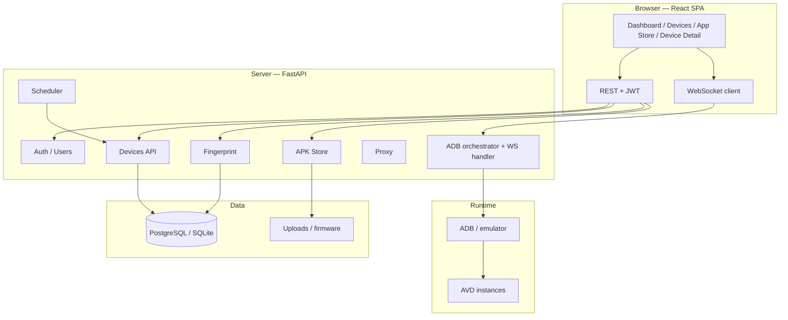
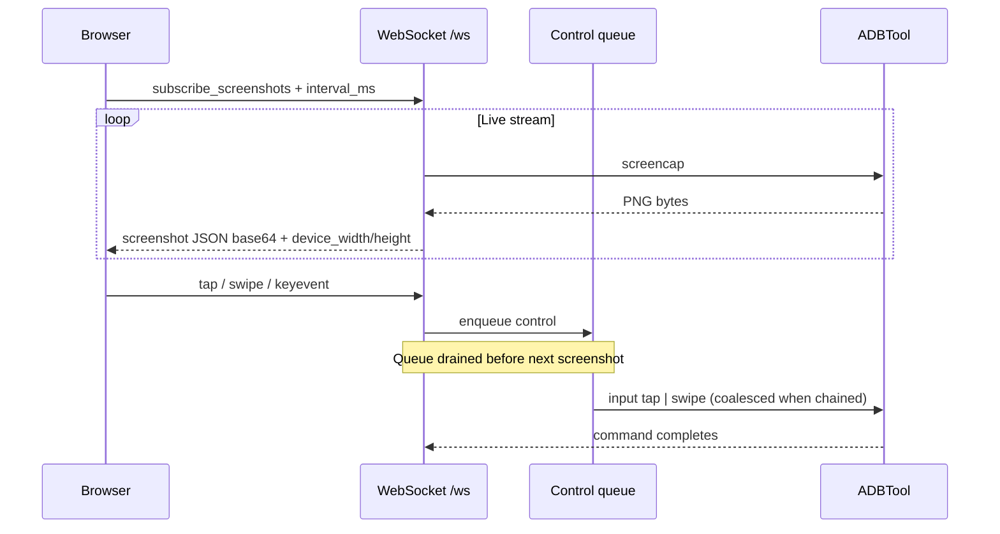
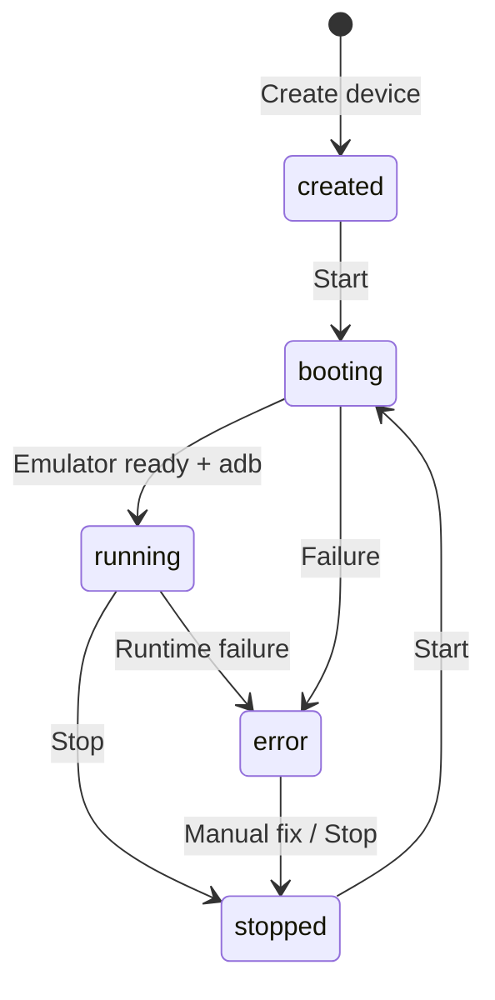
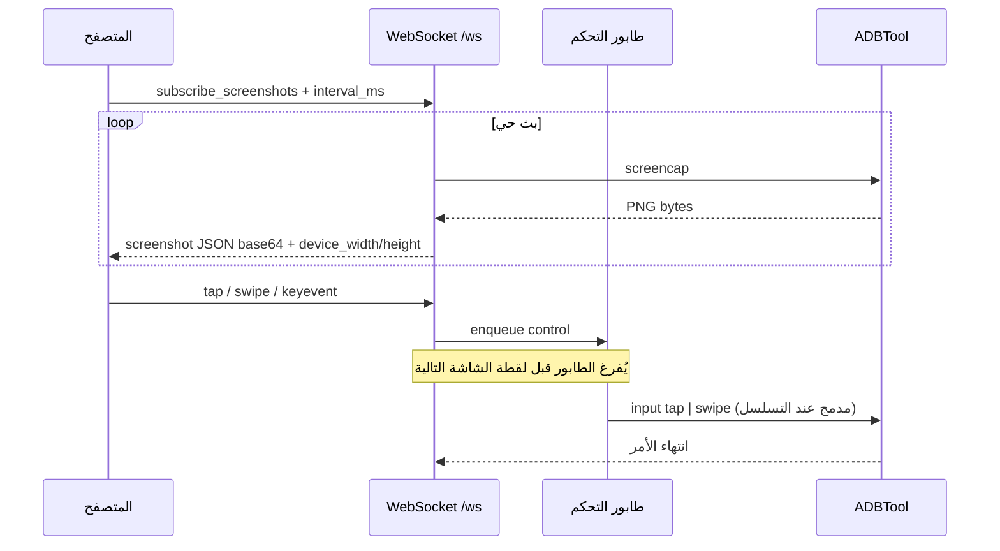
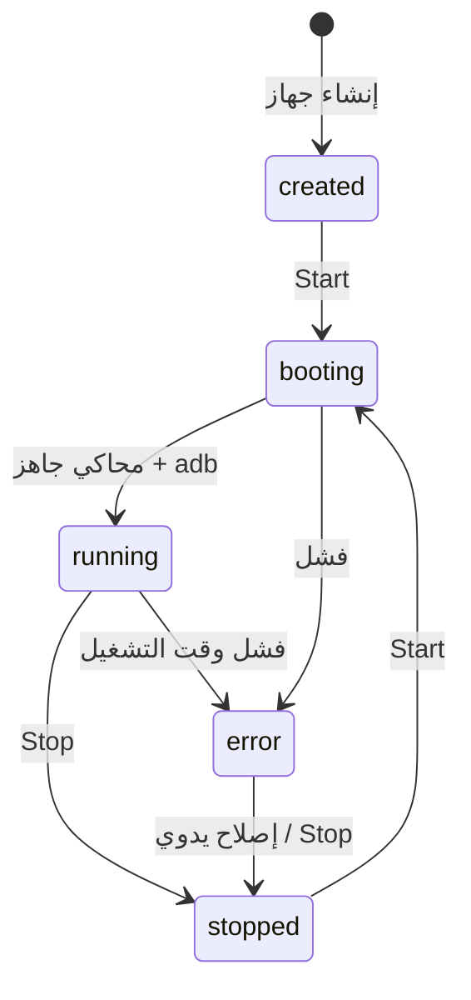

# Android Emulator Farm

> **Language / اللغة:** The **default** README is **English** (Part I). **Full Arabic** documentation is in **Part II** — [انتقل إلى العربية](#part-ii--arabic-documentation-العربية) · [Jump to Arabic](#part-ii--arabic-documentation-العربية).

[](https://github.com/code-root/emulator-android/actions/workflows/ci.yml)


Web-based **Android Virtual Device (AVD) farm**: create emulated devices, **unique fingerprints** per instance, start/stop, **live screen** over WebSocket (JPEG), **touch/drag** via ADB, **APK store**, HTTP/SOCKS proxy, **SAMFW** firmware alignment presets, REST API + OpenAPI/Swagger.

**Suggested GitHub “About” description:**  
*Android AVD farm — FastAPI + React: live WebSocket mirror, ADB input, per-device fingerprint spoofing, APK store, proxy, Docker, SAMFW presets.*

---

## Part I — English (default)

### Table of contents

1. [Overview & how it works](#overview--how-it-works)
2. [Architecture diagram](#architecture-diagram)
3. [Live stream & control flow](#live-stream--control-flow)
4. [Device lifecycle](#device-lifecycle)
5. [Features (current release)](#features-current-release)
6. [Tech stack](#tech-stack)
7. [Quick start](#quick-start)
8. [REST API & WebSocket](#rest-api--websocket)
9. [SAMFW packages & fingerprint](#samfw-packages--fingerprint)
10. [V2 Pro — USD 1,000](#v2-pro--usd-1000)
11. [Suggested GitHub Topics](#suggested-github-topics)
12. [CI](#ci)
13. [Maintainer, company & contact](#maintainer-company--contact)
14. [Support this project (optional)](#support-this-project-optional)
15. [License](#license)
16. [Publishing to GitHub](#publishing-to-github)

---

### Overview & how it works

The stack splits **control plane** (FastAPI + DB + scheduler), **web UI** (React + Vite), and an **ADB client** on the server talking to emulators or attached devices.

- Users authenticate and receive a **JWT**.
- **Devices** are stored in the DB per owner; each device has a **fingerprint** profile and optional **proxy**.
- **Start** launches an **emulator (AVD)** or binds an **ADB serial**; ports/IDs are persisted for control.
- **Live screenshots:** the browser subscribes via WebSocket (`subscribe_screenshots`); the server runs `adb screencap` (per-device locking to avoid races), optionally encodes **JPEG**, sends Base64 JSON with **device_width / device_height** for correct touch mapping.
- **Touch & drag:** the UI sends `tap` / `swipe` over WebSocket; messages go through a **control queue drained before** the next screencap so long captures do not starve input. **Chained swipe segments** can be **coalesced** server-side into one logical `swipe` (fewer ADB round-trips, same end-to-end path).
- **APK store:** upload packages and install on running devices via ADB, including **split APK** flows (`install-multiple`) where applicable.

Extended spec: [`docs/REFERENCE_SPEC.md`](docs/REFERENCE_SPEC.md).

---

### Architecture diagram



---

### Live stream & control flow



---

### Device lifecycle



---

### Features (current release)

| Area | Description |
|------|-------------|
| **Device management** | CRUD-style lifecycle, RAM/CPU/API level, AVD name + ADB serial |
| **Per-device fingerprint** | IMEI, Android ID, build fingerprint, model/network/geo, Samsung AP/CSC, `setprop` where allowed |
| **Web UI** | Dashboard, devices, device detail (screen, fingerprint, apps, proxy, logs), **App Store** |
| **Screen mirror** | WebSocket, configurable JPEG, idle-frame deduplication (project settings) |
| **Input** | Tap, multi-segment drag, system keys, `input text` via ADB |
| **Network** | HTTP / SOCKS5 proxy configuration (per implementation) |
| **SAMFW** | Discover packages under `firmware/`, suggested presets, fingerprint alignment |
| **Security** | JWT, user/admin roles, device ownership |
| **Docker** | Compose stack with Postgres / Redis / Nginx |
| **CI** | GitHub Actions: backend, frontend, compose validation |

---

### Tech stack

| Layer | Stack |
|-------|--------|
| Backend | Python 3.11+, FastAPI, SQLAlchemy async, Pydantic, Uvicorn |
| Database | PostgreSQL (prod) / SQLite + aiosqlite (local dev via `scripts/run_dev_local.sh`) |
| Frontend | React 18, TypeScript, Vite, Tailwind, React Router, TanStack Query, Zustand |
| DevOps | Docker Compose, Nginx, GitHub Actions |
| Android | Android SDK, `emulator`, `adb`, AVD |

---

### Quick start

**Docker (full stack):**

```bash
docker compose -f docker/docker-compose.yml up --build
```

UI is usually **http://localhost:8080**; API under **`/api/...`** (see `docker/` Nginx config).

**Local dev (SQLite) script:**

```bash
./scripts/run_dev_local.sh
```

**Manual dev (short):**

```bash
cd backend && python3.12 -m venv .venv && source .venv/bin/activate && pip install -r requirements.txt && uvicorn main:app --reload --port 8000
cd frontend && npm install && npm run dev
```

**Release tarball:**

```bash
./scripts/package_release.sh
```

---

### REST API & WebSocket

- **REST:** `Authorization: Bearer <token>` after `/api/auth/login` — interactive docs at `/docs` (Swagger).
- **WebSocket:** `ws://<host>/ws/{device_id}?token=<jwt>` — screenshot subscription, `tap` / `swipe` / `keyevent` / `input_text`.

Full endpoint matrix: [`docs/REFERENCE_SPEC.md`](docs/REFERENCE_SPEC.md).

---

### SAMFW packages & fingerprint

Place SAMFW-style ZIPs under [`firmware/`](firmware/) and follow [`firmware/README.md`](firmware/README.md). Large binaries are **gitignored** by default.

---

### V2 Pro — USD 1,000

**V2 Pro** targets teams that need **higher performance, broader operations, and commercial support**. Reference price: **USD 1,000** (scope & licensing negotiable — contact below).

| Capability | Benefit |
|------------|---------|
| **Low-latency video path** | **gRPC / WebRTC** (scrcpy / EmulatorController style) for local emulators — closer to real-time than ADB screencap alone |
| **Advanced touch** | Richer touch streams (pressure, multi-touch where applicable) beyond `input swipe` only |
| **Multi-tenant** | Isolation, quotas, usage-based billing |
| **RBAC** | Fine-grained roles for devices and stores |
| **Session replay** | Record/replay for QA, audit, training |
| **Multi-node farm** | Scheduling across hosts, health-aware queues |
| **Observability** | Grafana/Prometheus — FPS, frame latency, ADB time, CPU/RAM per device |
| **Webhooks & automation** | Device events to CI/CD, Slack, Discord |
| **Pro fingerprint packs** | Curated templates per market/chipset |
| **Secrets & encryption** | Secret manager integration, field-level encryption, key rotation |
| **White-label** | Branding, theme, custom domain |
| **Priority support & SLA** | Production response-time agreements |

> V2 is not automatically open-sourced in this repo; commercial terms via contact channels below.

---

### Suggested GitHub Topics

```
android
android-emulator
avd
adb
fastapi
react
typescript
websocket
docker
docker-compose
postgresql
sqlite
fingerprint
device-farm
remote-control
apk
samfw
devops
openapi
jwt
```

---

### CI

Workflow [`.github/workflows/ci.yml`](.github/workflows/ci.yml): backend install + `compileall` + FastAPI import; frontend `npm ci`/`npm install` + build; Docker Compose validation.

---

### Maintainer, company & contact

| | |
|--|--|
| **Developer** | Mostafa El-Bagory |
| **Company** | Storage TE |
| **WhatsApp** | +20 100 199 5914 |

---

### Support this project (optional)

If this documentation (or related private tooling) is useful to you, **optional** support helps maintain and improve it. Pick whatever works best for you.

| Channel | How to support |
|---------|----------------|
| **PayPal** | [paypal.me/sofaapi](https://paypal.me/sofaapi) |
| **Binance Pay / UID** | **1138751298** — send from the Binance app (Pay / internal transfer when available). |
| **Binance — deposit (web)** | Sign in, pick the asset, then **BSC (BEP20)** for deposit. |
| **BSC address (copy)** | `0x94c5005229784d9b7df4e7a7a0c3b25a08fd57bc` |
| **Network** | Use **BSC (BEP-20) only**. This address is for **USDT (BEP-20)** and **BTC on BSC** (Binance-Peg / in-app “BTC” on BSC), matching typical Binance deposit screens. **Do not** send native on-chain Bitcoin, ERC-20, or NFTs to this address. |

**Deposit QR (scan in Binance or any BSC wallet):**

| USDT · BSC (BEP-20) | BTC · BSC (Binance-Peg) |
|---------------------|-------------------------|
|  |  |

Same **BSC (BEP-20)** address as in the table above: `0x94c5005229784d9b7df4e7a7a0c3b25a08fd57bc`. **Note:** one QR is for **USDT** on BSC, the other for **BTC on BSC** (Binance-Peg) — not native on-chain Bitcoin. See [`assets/README.md`](assets/README.md).

---

### License

Licensed under the [MIT License](LICENSE) unless third-party files state otherwise.

---

### Publishing to GitHub

```bash
git remote add origin https://github.com/code-root/emulator-android.git
git branch -M main
git push -u origin main
```

CI badge points to **`code-root/emulator-android`**; change it if you fork under another user/org.

---

## Part II — Arabic documentation (العربية)

> **الجزء الثاني:** نسخة عربية كاملة من نفس المحتوى. **الجزء الأول أعلاه بالإنجليزية هو الافتراضي على GitHub.**

### جدول المحتويات (عربي)

1. [نظرة عامة وآلية العمل](#نظرة-عامة-وآلية-العمل)
2. [رسم — البنية المعمارية](#رسم--البنية-المعمارية)
3. [رسم — تدفق البث والتحكم](#رسم--تدفق-البث-والتحكم)
4. [رسم — دورة حياة الجهاز](#رسم--دورة-حياة-الجهاز)
5. [المميزات](#المميزات)
6. [المكدس التقني](#المكدس-التقني)
7. [التشغيل السريع](#التشغيل-السريع)
8. [API و WebSocket](#api-و-websocket)
9. [SAMFW والبصمة](#samfw-والبصمة)
10. [V2 Pro — 1,000 USD](#v2-pro--1000-usd)
11. [وسوم GitHub](#وسوم-github)
12. [الـ CI](#الـ-ci)
13. [الصيانة والاتصال](#الصيانة-والاتصال)
14. [دعم المشروع](#دعم-المشروع)
15. [الترخيص](#الترخيص)
16. [الرفع إلى GitHub](#الرفع-إلى-github)

---

### نظرة عامة وآلية العمل

المشروع يفصل **طبقة التحكم** (FastAPI + قاعدة بيانات + مجدول) و**واجهة المستخدم** (React + Vite) و**عميل ADB** على الخادم.

- تسجيل الدخول و**JWT**.
- **أجهزة** في قاعدة البيانات لكل مالك؛ **بصمة** و**بروكسي** اختياري.
- **Start** يشغّل **emulator (AVD)** أو يربط **ADB serial**.
- **بث الشاشة:** اشتراك WebSocket (`subscribe_screenshots`)، `adb screencap` مع قفل لكل جهاز، JPEG، Base64 مع أبعاد الجهاز لتحويل إحداثيات اللمس.
- **لمس وسحب:** `tap` / `swipe` عبر WebSocket؛ **طابور تحكم** يُفرغ قبل اللقطة التالية؛ **دمج مقاطع السحب المتسلسلة** في `swipe` واحد عند الإمكان.
- **مستودع APK:** رفع وتثبيت عبر ADB، بما في ذلك **split APKs** (`install-multiple`).

مرجع موسّع: [`docs/REFERENCE_SPEC.md`](docs/REFERENCE_SPEC.md).

---

### رسم — البنية المعمارية


---

### رسم — تدفق البث والتحكم



---

### رسم — دورة حياة الجهاز



---

### المميزات

| المجال | الوصف |
|--------|--------|
| **إدارة الأجهزة** | إنشاء/قائمة/تشغيل/إيقاف، موارد، AVD وADB serial |
| **بصمة لكل جهاز** | IMEI، Android ID، build fingerprint، Samsung AP/CSC، setprop حيث يسمح |
| **واجهة ويب** | لوحة، أجهزة، تفاصيل، App Store |
| **بث شاشة** | WebSocket، JPEG، تقليل التكرار عند الخمول |
| **إدخال** | لمس، سحب متعدد المقاطع، أزرار نظام، نص |
| **شبكة** | HTTP/SOCKS5 |
| **SAMFW** | اكتشاف الحزم وpresets |
| **أمان** | JWT، أدوار، امتلاك الأجهزة |
| **Docker** | Compose كامل |
| **CI** | GitHub Actions |

---

### المكدس التقني

| الطبقة | التقنيات |
|--------|----------|
| Backend | Python 3.11+، FastAPI، SQLAlchemy async، Pydantic، Uvicorn |
| DB | PostgreSQL / SQLite + aiosqlite |
| Frontend | React 18، TypeScript، Vite، Tailwind، React Router، TanStack Query، Zustand |
| DevOps | Docker Compose، Nginx، GitHub Actions |
| Android | SDK، emulator، adb، AVD |

---

### التشغيل السريع

```bash
docker compose -f docker/docker-compose.yml up --build
```

```bash
./scripts/run_dev_local.sh
```

```bash
cd backend && python3.12 -m venv .venv && source .venv/bin/activate && pip install -r requirements.txt && uvicorn main:app --reload --port 8000
cd frontend && npm install && npm run dev
```

```bash
./scripts/package_release.sh
```

---

### API و WebSocket

- **REST:** `Authorization: Bearer <token>` — `/docs`
- **WebSocket:** `ws://<host>/ws/{device_id}?token=<jwt>`

التفاصيل: [`docs/REFERENCE_SPEC.md`](docs/REFERENCE_SPEC.md).

---

### SAMFW والبصمة

ضع الأرشيفات تحت [`firmware/`](firmware/) — [`firmware/README.md`](firmware/README.md). الملفات الضخمة مستبعدة من Git.

---

### V2 Pro — 1,000 USD

**V2 Pro** للفرق التي تحتاج أداءً أعلى ودعمًا تجاريًا. **1,000 USD** مرجعي (النطاق والترخيص بالاتفاق).

| الميزة | الفائدة |
|--------|---------|
| فيديو منخفض الزمن | gRPC / WebRTC |
| لمس متقدم | ضغط، متعدد اللمس |
| Multi-tenant | عزل وحصص |
| RBAC | صلاحيات دقيقة |
| Session replay | تسجيل وإعادة تشغيل |
| مزرعة متعددة العقد | جدولة وموازنة |
| مراقبة | Grafana/Prometheus |
| Webhooks | أتمتة |
| حزم بصمات احترافية | تحديثات دورية |
| تشفير وأسرار | Secret manager |
| White-label | علامة مخصصة |
| دعم وSLA | أولوية إنتاج |

> V2 تجاري؛ التفاصيل عبر قنوات الاتصال.

---

### وسوم GitHub

انسخ نفس قائمة **Suggested GitHub Topics** من الجزء الإنجليزي أعلاه.

---

### الـ CI

نفس سير العمل [`.github/workflows/ci.yml`](.github/workflows/ci.yml) الموضح في القسم الإنجليزي.

---

### الصيانة والاتصال

| | |
|--|--|
| **المطوّر** | Mostafa El-Bagory |
| **الشركة** | Storage TE |
| **واتساب** | +20 100 199 5914 |

---

### دعم المشروع

نفس جدول **Support this project** في القسم الإنجليزي (PayPal، Binance، عنوان BSC، تحذيرات الشبكة).  
**صور QR للإيداع:**

| USDT · BSC | BTC · BSC |
|------------|-----------|
|  |  |

نفس تحذيرات الشبكة والعنوان أعلاه. **ملاحظة:** إحدى الصورتين لإيداع **USDT** على BSC والثانية لـ **BTC على BSC** (Binance-Peg)، وليست تحويل بيتكوين على سلسلة Bitcoin الأصلية. التفاصيل: [`assets/README.md`](assets/README.md).

---

### الترخيص

[MIT License](LICENSE).

---

### الرفع إلى GitHub

```bash
git remote add origin https://github.com/code-root/emulator-android.git
git branch -M main
git push -u origin main
```

شارة CI تشير إلى **code-root/emulator-android**؛ غيّرها عند الفورك.
